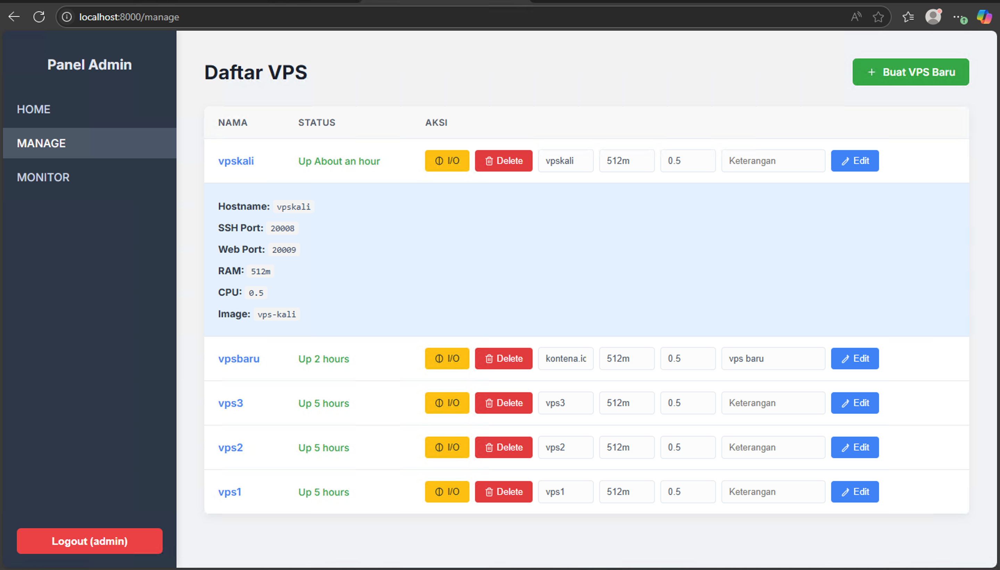

# VPS Container Web

Project ini adalah aplikasi FastAPI sederhana untuk mengelola VPS melalui web.


## Persyaratan Sebelum Memulai

Pastikan perangkat Anda sudah memiliki:

- Python 3
- Image Docker `vps-image` (buat custom image terlebih dahulu)
- Docker
- Install dependency Python:

```bash
pip install fastapi uvicorn jinja2
pip install python-multipart

Cara Menjalankan Aplikasi

uvicorn main:app --reload

Buka browser dan akses http://localhost:8000

## Struktur Direktori

vpscontainer/
├── main.py           ← FastAPI app
|── Dockerfile        ← Membuat Custom Images
|── supervisord.conf  ← Process manager di dalam container
├── templates/
│   ├── form.html     ← Form input VPS
│   └── manage.html   ← Form control VPS
│   └── monitor.html  ← Form monitoring VPS

## Membuat Custome Image

docker build -f Dockerkali -t vps-kali .

```
# # Cara menjalankan FastAPI di production 

```bash
uvicorn main:app --host 0.0.0.0 --port 8000 --workers 4

```

# # Jalankan Otomatis sebagai service / daemon (misal systemd)

Biar server kamu jalan otomatis dan stabil:

Contoh file service systemd /etc/systemd/system/fastapi.service:

```bash

[Unit]
Description=FastAPI application
After=network.target

[Service]
User=youruser
Group=yourgroup
WorkingDirectory=/path/to/your/app
ExecStart=/usr/local/bin/gunicorn main:app -w 4 -k uvicorn.workers.UvicornWorker --bind 0.0.0.0:8000
Restart=always

[Install]
WantedBy=multi-user.target

```

Lalu aktifkan:

```bash

sudo systemctl daemon-reload
sudo systemctl start fastapi
sudo systemctl enable fastapi

```

